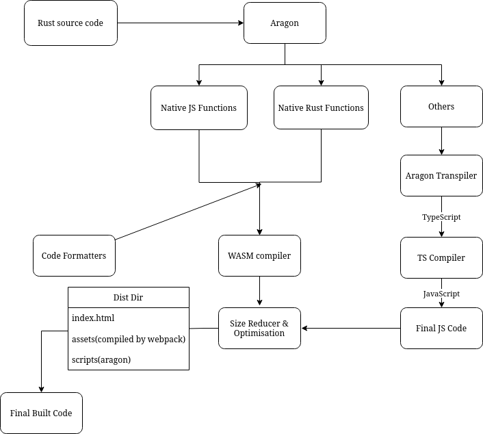

# Aragon

> Aragon is a library and technologie for build website with components, router dynammicly.

## How Aragon work ?

This schema represent how aragon work:


Many technologies are used in this project like `Web Assembly (WASM)`, `TypeScript (TSC)` and `Webpack`.

## How to install Aragon

> Aragon is currently in development. Any version are published and available for website development. 

### 1. Clone repo and build manually

```shell
> git clone https://github.com/waterdrop-io/aragon
```

```shell
> cargo build
```